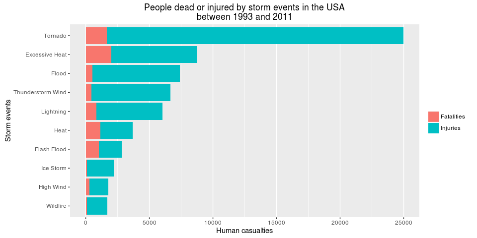
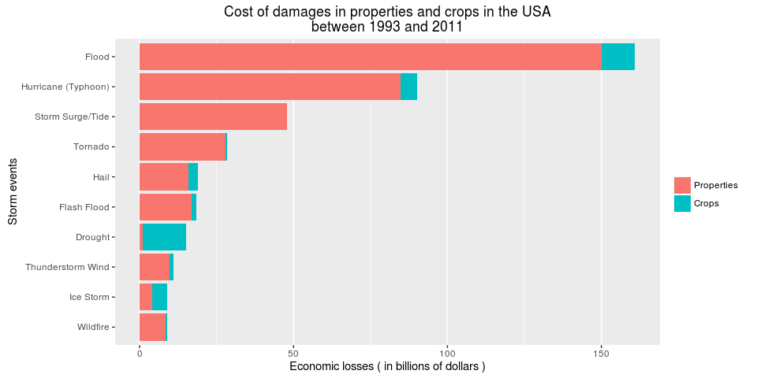

# Harmful weather events in the United States between 1993 and 2011
Jose Ignacio Gómez Marcelo  


## Synopsis
The aim of this study is to find out which are the most dangerous meteorological phenomena in the United States, by using the database maintained by the U.S. National Oceanic and Atmospheric Administration ( NOAA) since 1950.

Two dimensions will be explored regarding the dangerousness of the events. On the one hand the human cost, in terms of people killed or injured by a meteorological event. On the other hand the economic impact of these events, based on the cost of the destruction of properties and crops, expressed in US dollars.

As will be outlined in this paper, the most damaging weather events are different ones both in each of the aforementioned dimensions, and in each of different types of damage they can cause.

## Data processing

### Software
This data analysis was carried out using R, a free software environment for statistical computing and graphics.

```r
sessionInfo()
```

```
## R version 3.3.1 (2016-06-21)
## Platform: x86_64-pc-linux-gnu (64-bit)
## Running under: Ubuntu 16.04.1 LTS
## 
## locale:
##  [1] LC_CTYPE=en_GB.UTF-8       LC_NUMERIC=C              
##  [3] LC_TIME=en_GB.UTF-8        LC_COLLATE=en_GB.UTF-8    
##  [5] LC_MONETARY=en_GB.UTF-8    LC_MESSAGES=en_GB.UTF-8   
##  [7] LC_PAPER=en_GB.UTF-8       LC_NAME=C                 
##  [9] LC_ADDRESS=C               LC_TELEPHONE=C            
## [11] LC_MEASUREMENT=en_GB.UTF-8 LC_IDENTIFICATION=C       
## 
## attached base packages:
## [1] stats     graphics  grDevices utils     datasets  methods   base     
## 
## loaded via a namespace (and not attached):
##  [1] magrittr_1.5    formatR_1.4     tools_3.3.1     htmltools_0.3.5
##  [5] yaml_2.1.13     Rcpp_0.12.7     stringi_1.1.1   rmarkdown_1.0  
##  [9] knitr_1.14      stringr_1.1.0   digest_0.6.10   evaluate_0.9
```
Additionally, the packages `data.table`, `stringr`and `ggplot2` were used.


```r
library(data.table)
library(stringr)
library(ggplot2)
```

### Reading and subsetting the dataset
The storm events dataset was downloaded from [here](https://d396qusza40orc.cloudfront.net/repdata%2Fdata%2FStormData.csv.bz2), and saved in the working directory.


```r
if (!"repdata_data_StormData.csv.bz2" %in% list.files()) download.file("https://d396qusza40orc.cloudfront.net/repdata%2Fdata%2FStormData.csv.bz2", destfile = "repdata_data_StormData.csv.bz2")
```

The size of the file is about 49 MB, compressed, and more than 560 MB uncompressed, so we used `fread` function, from `data.table` package, for a quicker loading. Note that the following code only works in Linux platforms. Otherwise, you must first extract the .csv file in your working directory, and then read it using the `fread` function.


```r
stormdata <- fread(sprintf("bzcat %s", "repdata_data_StormData.csv.bz2"), header = TRUE, sep = ",")
```

```
## 
Read 0.0% of 967216 rows
Read 22.7% of 967216 rows
Read 37.2% of 967216 rows
Read 50.7% of 967216 rows
Read 56.9% of 967216 rows
Read 70.3% of 967216 rows
Read 78.6% of 967216 rows
Read 84.8% of 967216 rows
Read 902297 rows and 37 (of 37) columns from 0.523 GB file in 00:00:12
```

```
## Warning in fread(sprintf("bzcat %s", "repdata_data_StormData.csv.bz2"), :
## Read less rows (902297) than were allocated (967216). Run again with
## verbose=TRUE and please report.
```

```r
### In no Linux platforms you can run stormdata <- fread(repdata_data_StormData.csv", header = TRUE, sep = ",")
```

There is a warning about the difference between the lines allocated (967216) and read (902297), but this is not a concern. The `fread` function uses number of separators and end of lines in the dataset to calculate and allocate the number of rows, and sometimes it fails with the counting. The original file has, in fact, 902297 files and 37 variables.

Let's take a look at the dataset.


```r
str(stormdata)
```

```
## Classes 'data.table' and 'data.frame':	902297 obs. of  37 variables:
##  $ STATE__   : num  1 1 1 1 1 1 1 1 1 1 ...
##  $ BGN_DATE  : chr  "4/18/1950 0:00:00" "4/18/1950 0:00:00" "2/20/1951 0:00:00" "6/8/1951 0:00:00" ...
##  $ BGN_TIME  : chr  "0130" "0145" "1600" "0900" ...
##  $ TIME_ZONE : chr  "CST" "CST" "CST" "CST" ...
##  $ COUNTY    : num  97 3 57 89 43 77 9 123 125 57 ...
##  $ COUNTYNAME: chr  "MOBILE" "BALDWIN" "FAYETTE" "MADISON" ...
##  $ STATE     : chr  "AL" "AL" "AL" "AL" ...
##  $ EVTYPE    : chr  "TORNADO" "TORNADO" "TORNADO" "TORNADO" ...
##  $ BGN_RANGE : num  0 0 0 0 0 0 0 0 0 0 ...
##  $ BGN_AZI   : chr  "" "" "" "" ...
##  $ BGN_LOCATI: chr  "" "" "" "" ...
##  $ END_DATE  : chr  "" "" "" "" ...
##  $ END_TIME  : chr  "" "" "" "" ...
##  $ COUNTY_END: num  0 0 0 0 0 0 0 0 0 0 ...
##  $ COUNTYENDN: logi  NA NA NA NA NA NA ...
##  $ END_RANGE : num  0 0 0 0 0 0 0 0 0 0 ...
##  $ END_AZI   : chr  "" "" "" "" ...
##  $ END_LOCATI: chr  "" "" "" "" ...
##  $ LENGTH    : num  14 2 0.1 0 0 1.5 1.5 0 3.3 2.3 ...
##  $ WIDTH     : num  100 150 123 100 150 177 33 33 100 100 ...
##  $ F         : chr  "3" "2" "2" "2" ...
##  $ MAG       : num  0 0 0 0 0 0 0 0 0 0 ...
##  $ FATALITIES: num  0 0 0 0 0 0 0 0 1 0 ...
##  $ INJURIES  : num  15 0 2 2 2 6 1 0 14 0 ...
##  $ PROPDMG   : num  25 2.5 25 2.5 2.5 2.5 2.5 2.5 25 25 ...
##  $ PROPDMGEXP: chr  "K" "K" "K" "K" ...
##  $ CROPDMG   : num  0 0 0 0 0 0 0 0 0 0 ...
##  $ CROPDMGEXP: chr  "" "" "" "" ...
##  $ WFO       : chr  "" "" "" "" ...
##  $ STATEOFFIC: chr  "" "" "" "" ...
##  $ ZONENAMES : chr  "" "" "" "" ...
##  $ LATITUDE  : num  3040 3042 3340 3458 3412 ...
##  $ LONGITUDE : num  8812 8755 8742 8626 8642 ...
##  $ LATITUDE_E: num  3051 0 0 0 0 ...
##  $ LONGITUDE_: num  8806 0 0 0 0 ...
##  $ REMARKS   : chr  "" "" "" "" ...
##  $ REFNUM    : num  1 2 3 4 5 6 7 8 9 10 ...
##  - attr(*, ".internal.selfref")=<externalptr>
```

We have 902297 observations and 37 variables, but we only need those variables that provide us with information about the type of weather event and the damage they have caused, both economic and human.

A codebook of the dataset is available in this url:

[http://ire.org/media/uploads/files/datalibrary/samplefiles/Storm%20Events/layout08.doc](http://ire.org/media/uploads/files/datalibrary/samplefiles/Storm%20Events/layout08.doc)

So, according the codebook, the following variables are relevant to the analysis:

- `$BGN_DATE`: Date the storm event began. Character format.
- `$EVTYPE`: Type of storm event. Character format.
- `$FATALITIES`: Number directly killed. Numeric format.
- `$INJURIES`: Number directly injured. Numeric format.
- `$PROPDMG`: Property damage in whole numbers and hundredths. Numeric format
- `$PROPDMGEXP`: A multiplier for `$PROPDMG`. Character format.
- `$CROPDMG`: Crop damage in whole numbers and hundredths. Numeric format.
- `$CROPDMGEXP`: A multiplier for `$CROPDMG`. Character format.

On the other hand, we can see in the [Storm Event Database detail page](https://www.ncdc.noaa.gov/stormevents/details.jsp) that from 1950 to 1954, only tornado events were recorded. And from 1955 to 1996, only tornado, thunderstorm wind and hail events were extracted from the paper publications or unformmated text files.

So, `$BGN_DATE` is also selected, in order to perform subsequents subsets.


```r
stormdata <- stormdata[, c(2, 8, 23:28), with = FALSE]
```

First of all, we transformed the `$BGN_DATE` into date format.


```r
stormdata$BGN_DATE <- as.Date(stormdata$BGN_DATE, format = "%m/%d/%Y")
```

Now let's check the point about unique events along the years.


```r
tapply(stormdata$EVTYPE, format(stormdata$BGN_DATE, "%Y"), function(x) length(unique(x)))
```

```
## 1950 1951 1952 1953 1954 1955 1956 1957 1958 1959 1960 1961 1962 1963 1964 
##    1    1    1    1    1    3    3    3    3    3    3    3    3    3    3 
## 1965 1966 1967 1968 1969 1970 1971 1972 1973 1974 1975 1976 1977 1978 1979 
##    3    3    3    3    3    3    3    3    3    3    3    3    3    3    3 
## 1980 1981 1982 1983 1984 1985 1986 1987 1988 1989 1990 1991 1992 1993 1994 
##    3    3    3    3    3    3    3    3    3    3    3    3    3  160  267 
## 1995 1996 1997 1998 1999 2000 2001 2002 2003 2004 2005 2006 2007 2008 2009 
##  387  228  170  126  121  112  122   99   51   38   46   50   46   46   46 
## 2010 2011 
##   46   46
```

From 1950 to 1954 only one event have been recorded. Also, from 1955 to 1992 three events have been recorded. But from that point onward we find a lot of differents events per year. From 2003 onward there are around the official number of unique events per year, which is 48. It seems that from 1993 to 2002 there was some kind of coding problem in the collection process.

Our objetive is to compare the harmful of different types of weather events that occur in the United States of America. In order to do this we will take into account both the destructive power of each episodic event and its frequency. Therefore, if we include the events that occurred before 1993, when only a few events were recorded, we will be skewing the results, as tornadoes, thunderstorm winds and hail events will be over-represented. Therefore we will only analyze data from 1993 onwards.

Let's subset the dataset.


```r
stormdata <- subset(stormdata, stormdata$BGN_DATE > "1992-12-31")
```

We have now 714738 events recorded, from 1993-01-01 to 2011-11-30.

### Transforming variables

Let's take a look into `$EVTYPE` variable.


```r
length(unique(stormdata$EVTYPE))
```

```
## [1] 985
```

There are 985 event types but, according to [NWS Directive 10-1605](https://www.ncdc.noaa.gov/stormevents/pd01016005curr.pdf), only 48 events are permitted in Storm Data (there is a newer directive, from March 23rd 2016, that adds 7 new events, but it doesn't apply to this dataset). The permitted events are the following:


```r
offevents <- c("Astronomical Low Tide", "Avalanche", "Blizzard", "Coastal Flood", "Cold/Wind Chill", "Debris Flow", "Dense Fog", "Dense Smoke", "Drought", "Dust Devil", "Dust Storm", "Excessive Heat", "Extreme Cold/Wind Chill", "Flash Flood", "Flood", "Frost/Freeze", "Funnel Cloud", "Freezing Fog", "Hail", "Heat", "Heavy Rain", "Heavy Snow", "High Surf", "High Wind", "Hurricane (Typhoon)", "Ice Storm", "Lake-Effect Snow", "Lakeshore Flood", "Lightning", "Marine Hail", "Marine High Wind", "Marine Strong Wind", "Marine Thunderstorm Wind", "Rip Current", "Seiche", "Sleet", "Storm Surge/Tide", "Strong Wind", "Thunderstorm Wind", "Tornado", "Tropical Depression", "Tropical Storm", "Tsunami", "Volcanic Ash", "Waterspout", "Wildfire", "Winter Storm", "Winter Weather")
```

Let's make some data cleaning on `$EVTYPE`.

Firstly, we remove trailing, leading spaces and all extra spaces between words on the new variable.


```r
stormdata$EVTYPE <- gsub("\\s+", " ", str_trim(stormdata$EVTYPE))
```

Convert all characters to lower case.


```r
stormdata$EVTYPE <- tolower(stormdata$EVTYPE)
```

And make a data frame with all unique values and their frequencies, so we can work easily with the events.


```r
events <- data.frame(stormdata[, .N, by = EVTYPE])
```

Now we have 883 events. Let's recode them.


```r
events$recode <- NA
events$recode[grepl("astronomical low tide", events$EVTYPE, perl = TRUE)] = offevents[1]
events$recode[is.na(events$recode) & grepl("^aval", events$EVTYPE, perl = TRUE)] = offevents[2]
events$recode[is.na(events$recode) & grepl("^bliz", events$EVTYPE, perl = TRUE)] = offevents[3]
events$recode[is.na(events$recode) & grepl("^coast|^beach|cstl|astronomical high tide", events$EVTYPE, perl = TRUE)] = offevents[4]
events$recode[is.na(events$recode) & grepl("^cold/wind chill|^cold wind chill|^cold$|^prolong cold", events$EVTYPE, perl = TRUE)] = offevents[5]
events$recode[is.na(events$recode) & grepl("^landslide|^land slide|^mudslide|^mud slide", events$EVTYPE, perl = TRUE)] = offevents[6]
events$recode[is.na(events$recode) & grepl("^dense fog|^fog", events$EVTYPE, perl = TRUE)] = offevents[7]
events$recode[is.na(events$recode) & grepl("^dense smoke|smoke", events$EVTYPE, perl = TRUE)] = offevents[8]
events$recode[is.na(events$recode) & grepl("^drou|^unseasonably dry", events$EVTYPE, perl = TRUE)] = offevents[9]
events$recode[is.na(events$recode) & grepl("^dust devil", events$EVTYPE, perl = TRUE)] = offevents[10]
events$recode[is.na(events$recode) & grepl("^dust storm", events$EVTYPE, perl = TRUE)] = offevents[11]
events$recode[is.na(events$recode) & grepl("^excessive heat|extreme heat|record warmth|record heat", events$EVTYPE, perl = TRUE)] = offevents[12]
events$recode[is.na(events$recode) & grepl("^extreme cold|^record cold|^extreme wind chill|^extreme windchill", events$EVTYPE, perl = TRUE)] = offevents[13]
events$recode[is.na(events$recode) & grepl("^flash.*flood|^flood.*flash", events$EVTYPE, perl = TRUE)] = offevents[14]
events$recode[is.na(events$recode) & grepl("^(?=flood)(?!.*flash)|urban/sml stream fld|river flood|urban flood", events$EVTYPE, perl = TRUE)] = offevents[15]
events$recode[is.na(events$recode) & grepl("^frost/freeze|freeze|frost", events$EVTYPE, perl = TRUE)] = offevents[16]
events$recode[is.na(events$recode) & grepl("funnel|cloud", events$EVTYPE, perl = TRUE)] = offevents[17]
events$recode[is.na(events$recode) & grepl("^freezing fog", events$EVTYPE, perl = TRUE)] = offevents[18]
events$recode[is.na(events$recode) & grepl("^hail|^small hail", events$EVTYPE, perl = TRUE)] = offevents[19]
events$recode[is.na(events$recode) & grepl("^heat|^unseasonably warm", events$EVTYPE, perl = TRUE)] = offevents[20]
events$recode[is.na(events$recode) & grepl("^heavy rain|excessive rain|record rain", events$EVTYPE, perl = TRUE)] = offevents[21]
events$recode[is.na(events$recode) & grepl("heavy snow|^snow$", events$EVTYPE, perl = TRUE)] = offevents[22]
events$recode[is.na(events$recode) & grepl("^heavy surf|^high surf", events$EVTYPE, perl = TRUE)] = offevents[23]
events$recode[is.na(events$recode) & grepl("^high wind", events$EVTYPE, perl = TRUE)] = offevents[24]
events$recode[is.na(events$recode) & grepl("^hurricane", events$EVTYPE, perl = TRUE)] = offevents[25]
events$recode[is.na(events$recode) & grepl("^ice storm|^snow/ice|^ice/snow|^ice$", events$EVTYPE, perl = TRUE)] = offevents[26]
events$recode[is.na(events$recode) & grepl("^lake effect snow|lake-effect", events$EVTYPE, perl = TRUE)] = offevents[27]
events$recode[is.na(events$recode) & grepl("^lakeshore flood", events$EVTYPE, perl = TRUE)] = offevents[28]
events$recode[is.na(events$recode) & grepl("^lightning", events$EVTYPE, perl = TRUE)] = offevents[29]
events$recode[is.na(events$recode) & grepl("^marine hail", events$EVTYPE, perl = TRUE)] = offevents[30]
events$recode[is.na(events$recode) & grepl("^marine high wind", events$EVTYPE, perl = TRUE)] = offevents[31]
events$recode[is.na(events$recode) & grepl("^marine strong wind", events$EVTYPE, perl = TRUE)] = offevents[32]
events$recode[is.na(events$recode) & grepl("marine thunderstorm|marine tstm", events$EVTYPE, perl = TRUE)] = offevents[33]
events$recode[is.na(events$recode) & grepl("^rip current", events$EVTYPE, perl = TRUE)] = offevents[34]
events$recode[is.na(events$recode) & grepl("^seiche", events$EVTYPE, perl = TRUE)] = offevents[35]
events$recode[is.na(events$recode) & grepl("^sleet", events$EVTYPE, perl = TRUE)] = offevents[36]
events$recode[is.na(events$recode) & grepl("^storm surge", events$EVTYPE, perl = TRUE)] = offevents[37]
events$recode[is.na(events$recode) & grepl("^strong wind|^wind|^gusty winds", events$EVTYPE, perl = TRUE)] = offevents[38]
events$recode[is.na(events$recode) & grepl("^thu|^tstm|^downburst|^dry microburst|gustnado", events$EVTYPE, perl = TRUE)] = offevents[39]
events$recode[is.na(events$recode) & grepl("^torn", events$EVTYPE, perl = TRUE)] = offevents[40]
events$recode[is.na(events$recode) & grepl("^tropical depression", events$EVTYPE, perl = TRUE)] = offevents[41]
events$recode[is.na(events$recode) & grepl("^tropical storm", events$EVTYPE, perl = TRUE)] = offevents[42]
events$recode[is.na(events$recode) & grepl("^tsunami", events$EVTYPE, perl = TRUE)] = offevents[43]
events$recode[is.na(events$recode) & grepl("^volcanic", events$EVTYPE, perl = TRUE)] = offevents[44]
events$recode[is.na(events$recode) & grepl("^waterspout", events$EVTYPE, perl = TRUE)] = offevents[45]
events$recode[is.na(events$recode) & grepl("^wild", events$EVTYPE, perl = TRUE)] = offevents[46]
events$recode[is.na(events$recode) & grepl("^winter storm|freezing rain|light snow|moderate snowfall|wintry mix", events$EVTYPE, perl = TRUE)] = offevents[47]
events$recode[is.na(events$recode) & grepl("^winter weather", events$EVTYPE, perl = TRUE)] = offevents[48]
```

Let's check how many events are classified into some of the 48 official events.


```r
tapply(events$N, !is.na(events$recode), sum)
```

```
##  FALSE   TRUE 
##   1386 713352
```

We have 713352 events classified and 1386 NAs. This means than 99.8% of the total number of events were coded. It seems reasonable, so let's match the `events$recode` levels with the data set.


```r
stormdata$EVTYPE_RECODE = events$recode[match(stormdata$EVTYPE, events$EVTYPE)]
```

Now let's work with `$PROPDMGEXP` and `$CROPDMGEXP`, the variables that multiply the numbers containing in `$PROPDMG` and `$CROPDMG`, respectively.

The official documentation states that "alphabetical characters used to signify magnitud include 'K' for thousands, 'M' for millions, and 'B' for billions". Let's check it.


```r
sort(unique(stormdata$PROPDMGEXP))
```

```
##  [1] ""  "-" "?" "+" "0" "1" "2" "3" "4" "5" "6" "7" "8" "B" "h" "H" "K"
## [18] "m" "M"
```

```r
sort(unique(stormdata$CROPDMGEXP))
```

```
## [1] ""  "?" "0" "2" "B" "k" "K" "m" "M"
```

There are many other characters besides "K", "M" and "B" in the official documentation. We can find [here](https://rstudio-pubs-static.s3.amazonaws.com/58957_37b6723ee52b455990e149edde45e5b6.html) a complete analysis about the meaning of these characters. They appear to be reasonable, so we proceed with the encoding of each character following this analysis.


```r
stormdata$PROPDMGEXP_COD[grepl("H|h", stormdata$PROPDMGEXP, perl = TRUE)] = 10^2
stormdata$PROPDMGEXP_COD[grepl("K|k", stormdata$PROPDMGEXP, perl = TRUE)] = 10^3
stormdata$PROPDMGEXP_COD[grepl("M|m", stormdata$PROPDMGEXP, perl = TRUE)] = 10^6
stormdata$PROPDMGEXP_COD[grepl("B|b", stormdata$PROPDMGEXP, perl = TRUE)] = 10^9
stormdata$PROPDMGEXP_COD[grepl("\\+", stormdata$PROPDMGEXP, perl = TRUE)] = 1
stormdata$PROPDMGEXP_COD[grepl("\\-|\\?|^\\s*$|^$", stormdata$PROPDMGEXP, perl = TRUE)] = 0
stormdata$PROPDMGEXP_COD[grepl("[0-8]", stormdata$PROPDMGEXP, perl = TRUE)] = 10
stormdata$CROPDMGEXP_COD[grepl("H|h", stormdata$CROPDMGEXP, perl = TRUE)] = 10^2
stormdata$CROPDMGEXP_COD[grepl("K|k", stormdata$CROPDMGEXP, perl = TRUE)] = 10^3
stormdata$CROPDMGEXP_COD[grepl("M|m", stormdata$CROPDMGEXP, perl = TRUE)] = 10^6
stormdata$CROPDMGEXP_COD[grepl("B|b", stormdata$CROPDMGEXP, perl = TRUE)] = 10^9
stormdata$CROPDMGEXP_COD[grepl("\\+", stormdata$CROPDMGEXP, perl = TRUE)] = 1
stormdata$CROPDMGEXP_COD[grepl("\\-|\\?|^\\s*$|^$", stormdata$CROPDMGEXP, perl = TRUE)] = 0
stormdata$CROPDMGEXP_COD[grepl("[0-8]", stormdata$CROPDMGEXP, perl = TRUE)] = 10
```

Now we can calculate the property and crop damages as dollar amounts by multiplying `$PROPDMG` and `$CROPDMG` by `$PROPDMGEXP_COD` and `$CROPDMGEXP_COD`, respectively.


```r
stormdata$PROPDMG_T <- stormdata$PROPDMG * stormdata$PROPDMGEXP_COD
stormdata$CROPDMG_T <- stormdata$CROPDMG * stormdata$CROPDMGEXP_COD
```

We achieved now the economic damage to properties and crops, by type of event, as dollar amounts.

We create a data frame with the sums of `$FATALITIES`, `$INJURIES` `$PROPDMG_T` and `$CROPDMG_T` for each event, and convert to long format in order to create the plots easily.

The `resumedf` data frame has 49 events instead of 48 because it includes the NA event, that is , those events that have not been recoded in one of the official events.


```r
### Resume by event
resumedf <- stormdata[,.(Fatalities = sum(FATALITIES), Injuries = sum(INJURIES), Prop_damages = sum(PROPDMG_T), Crop_damages = sum(CROPDMG_T)), by = EVTYPE_RECODE]
resumedf$humandmg <- resumedf$Fatalities + resumedf$Injuries
resumedf$econdmg <- resumedf$Prop_damages + resumedf$Crop_damages
colnames(resumedf) <- c("Events", "Fatalities", "Injuries", "Properties", "Crops", "Health_damages", "Economics_damages")
### Health damages on long format
top10healthdmg <- melt(data = head(resumedf[order(resumedf$Health_damages, decreasing = TRUE),], 10), id.vars = "Events", measure.vars = c("Fatalities", "Injuries"), variable.name = "Damage", value.name = "People")
### Economic damages on long format
top10economicdmg <- melt(data = head(resumedf[order(resumedf$Economics_damages, decreasing = TRUE),], 10), id.vars = "Events", measure.vars = c("Properties", "Crops"), variable.name = "Damage", value.name = "Dollars")
```

## Results

**Across the United States, which types of events are most harmful with respect to population health?**


```r
ggplot(data = top10healthdmg, aes(x = Events, y = People, fill = Damage)) + geom_bar(stat = "identity") + coord_flip() + ggtitle("People dead or injured by storm events in the USA\nbetween 1993 and 2011") + labs(x="Storm events",y="Human casualties") + scale_x_discrete(limits = tail(resumedf$Events[order(resumedf$Health_damages)], 10), labels = tail(resumedf$Events[order(resumedf$Health_damages)], 10)) + guides(fill=guide_legend(title=NULL)) + theme(panel.grid.minor.y=element_blank(), panel.grid.major.y=element_blank())
```

<!-- -->

The most harmful storm event to the people health is "Tornado", especially in regard to injuries. From 1993 to 2011 almost 25000 people were dead or injured due to tornadoes. The next in the ranking of dangerousness is "Excessive Heat"", but the total amount of people damaged is much lower, around 7500 people. Relative to fatalities, "Excessive Heat" is more dangerous than "Tornado". In fact, more than 3000 people have died from heat, between 1993 and 2011.

**Across the United States, which types of events have the greatest economic consequences?**


```r
ggplot(data = top10economicdmg, aes(x = Events, y = Dollars, fill = Damage)) + geom_bar(stat = "identity") + coord_flip() + ggtitle("Cost of damages in properties and crops in the USA\nbetween 1993 and 2011") + labs(x="Storm events",y="Economic losses ( in billions of dollars )") + scale_x_discrete(limits = tail(resumedf$Events[order(resumedf$Economics_damages)], 10), labels = tail(resumedf$Events[order(resumedf$Economics_damages)], 10)) + guides(fill=guide_legend(title=NULL)) + scale_y_continuous(labels=function(x)x/1000000000) + theme(panel.grid.minor.y=element_blank(), panel.grid.major.y=element_blank())
```

<!-- -->

The most economically costly weather event is flooding , with damage worth nearly 161 billion dollars between 1993 and 2011. The vast majority of this amount , about 150 billion, is due to property damage .

The biggest economic losses in crop damage are due to drought , which is in seventh place in the ranking, with about 15 billion dollars in losses.
